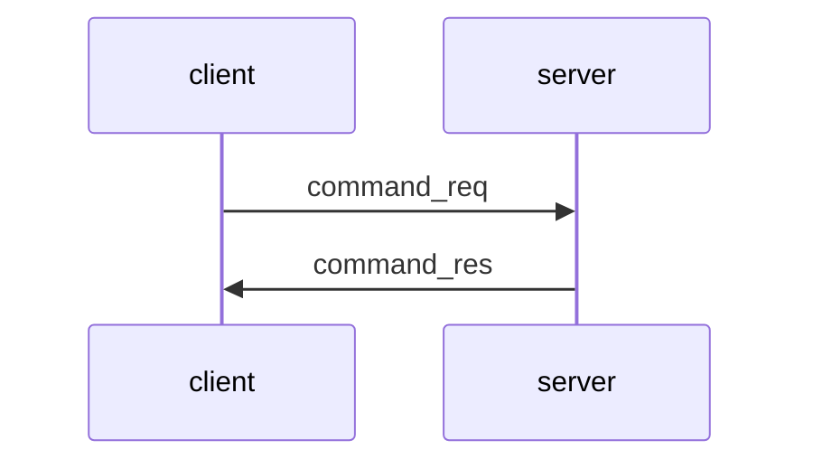

# Simple File Transfer Protocol (SiFTv1.0)

By Zhihan Chen (Lasted edited March 2024)

## Overview

The Simple File Transfer Protocol v1.0 (SiFTv1.0) is the final project of Applied Cryptography, a course taught by Professor Levente Buttyán at the Aquincum Institute of Technology (AIT) during fall of 2023. SiFTv1.0 can be used by a client to communicate with a server securely and teaches students how messages can be effectively encrypted and decrypted in a simple protocol. There are different ways SiFTv1.0 can be implemented to meet the specifications, this is just my way to do it.

SiFTv1.0 utilizes 5 sub-protocols: Message Transfer Protocol, Login Protocol, Commands Protocol, Upload Protocol, and Download Protocol.

```
  +--------------+  +-----------------+  +---------------+  +-----------------+
  |Login Protocol|  |Commands Protocol|  |Upload Protocol|  |Download Protocol|
  +--------------+  +-----------------+  +---------------+  +-----------------+
  +---------------------------------------------------------------------------+
  |                     Message Transfer Protocol (MTP)                       |
  +---------------------------------------------------------------------------+
```

### Confidentiality and Integrity Protection within the Message Transfer Protocol (MTP)

All SiFT v1.0 MTP messages have a 16-byte header, an encrypted payload, and the authentication tag (with the exception of the login request within the Login Protocol). The header consists of the following fields:

- **ver**: A 2-byte _version number_ field, which for SiFTv1.0 is the byte sequence `01 00`.
- **typ**: A 2-byte _message type_ field that specifies the type of the payload in the message. Refer to the more detailed [project specifications page](https://github.com/zhihanC/simple-file-transfer-protocol/blob/main/_specification/SiFT%20v1.0%20specification.md) for what kind of types are supported.
- **len**: A 2-byte _message length_ field that contains the length of the entire message (including the header) in bytes (using big endian byte order).
- **sqn**: A 2-byte _message sequence number_ field that contains the sequence number of this message (using big endian byte order).
- **rnd**: A 6-byte _random_ field that contains freshly generated random bytes.
- **rsv**: A 2-byte _reserved_ field which is not used in this version of the protocol (reserved for future versions). The value of this field in messages conforming this specification should be `00 00`.

The payload is encrypted using AES in GCM mode with the authentication tag attached after it, which provides encryption, integrity protection, and origin authentication. AES in GCM mode requires a symmetric key, which is established during the Login Protocol. The format of a message is shown below:

```
	+---+---+---+---+---+---+---+---+---+---+---+---+---+---+---+---+
	|  ver  |  typ  |  len  |  sqn  |          rnd          |  rsv  |
	+---+---+---+---+---+---+---+---+---+---+---+---+---+---+---+---+
	|                                                               |
	+                                                               +
	|                                                               |
	.                                                               .
	.                    encrypted payload (epd)                    .
	.                                                               .
	|                                                               |
	+                                                               +
	|                                                               |
	+               +---+---+---+---+---+---+---+---+---+---+---+---+
	|               |                      mac                      |
	+---+---+---+---+---+---+---+---+---+---+---+---+---+---+---+---+
```

### Handshake within the Login Protocol



SiFTv1.0 assumes that the client knows the server's public key and only the server with the corresponding private key would be able to decrypt and respond properly to the message. Since there is no shared secret symmetric key yet, the client and server must perform a handshake first. The client first sends the server a login request encrypted with a temporary 32-byte AES key. The temporary key is encrypted with RSA-OAEP with the server's 2048-bit RSA public key and attached at the end of the message. The login request's payload contains: the timestamp, username, password, and a randomly generated 16-byte value. The client will also compute the SHA-256 hash of the login request and store it for later verification. The format of a login request is show below:

```
	+---+---+---+---+---+---+---+---+---+---+---+---+---+---+---+---+
	|  ver  |  typ  |  len  |  sqn  |          rnd          |  rsv  |
	+---+---+---+---+---+---+---+---+---+---+---+---+---+---+---+---+
	|                                                               |
	+                                                               +
	|                                                               |
	.                                                               .
	.                    encrypted payload (epd)                    .
	.                                                               .
	|                                                               |
	+                                                               +
	|                                                               |
	+               +---+---+---+---+---+---+---+---+---+---+---+---+
	|               |                      mac                      |
	+---+---+---+---+---+---+---+---+---+---+---+---+---+---+---+---+
	|                                                               |
	.                                                               .
	.                encrypted temporary key (etk)                  .
	.                                                               .
	|                                                               |
	+---+---+---+---+---+---+---+---+---+---+---+---+---+---+---+---+
```

Upon receiving the login request, the server will decrypt the temporary 32-byte AES key with its own RSA private key and use the temporary key to decrypt the rest of the login request. Next, it verifies whether the timestamp is within the acceptance window, and whether the username and password are correct. Note, the server only stores password hashes hashed with PBKDF2 so the password must be hashed first before being verified. Once the login request is accepted, the server sends back a login response containing: the SHA-256 hash of the login request and a randomly generated 16-byte value.

If the SHA-256 hash of the login request that the server sent back in the login response matches the one stored by the client, the handshake is a success. The final key is derived using the HKDF key derivation function with SHA-256 as the internal hash function. The random 16-bytes sent by the client and the random 16-bytes sent by the server are concatonated together and used as initial key material, and the SHA-256 hash of the login request is used as salt. All subsequent MTP messages are protected with this final key.

The Overview Section of the ReadMe is my attempt to highlight the most important parts of SiFTv1.0. For more information, please read the [project specifications page](https://github.com/zhihanC/simple-file-transfer-protocol/blob/main/_specification/SiFT%20v1.0%20specification.md) provided by Professor Buttyán.

## Usage and Testing

### Running SiFTv1.0 Locally

- Run server/server.py and client/client.py in two separate terminals. Make sure to run the server before running the client so that the client can connect!

### Running SiFTv1.0 with other machines

- If you are running the server, make sure that the client machine has access to your public key. The public key included in this repo is client/siftprotocols/server_pubkey.pem. If you would like to use your own keypair, make sure to add your own private key in server/siftprotocols. Be sure to modify load_keypair() within server/siftprotocols/siftmtp.py to use the new private key to decrypt the temporary AES key of the login request as well. Next, modify the Server class constructor within server/server.py. Change server_ip to whatever your IP address is instead of using localhost.

- If you are running the client, make sure you have access to the server's public key. Be sure to modify send_login_request() within client/siftprotocols/siftmtp.py to encrypt the temporary AES key with the server's public key. Next, modify the config section of client/client.py. Instead of using localhost for server_ip, use the server's IP address instead.

### Helpful Tip: Corresponding Usernames and Passwords in SiFTv1.0

- alice -> aaa
- bob -> bbb
- charlie -> ccc

## Acknowledgements

A special thanks to Professor Buttyán and everyone at AIT!

## License

Feel free to view and test my code as a learning resource! However, since this is technically still a homework assignment, please do not copy, distribute, or modify this code without permission!
